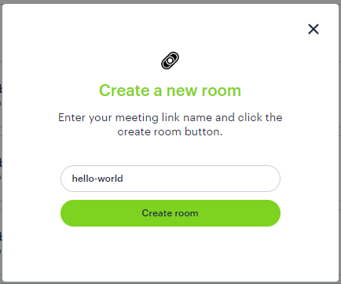

# Getting Started

Daily.co makes it easier than ever to get up-and-running with video on the web and beyond. There are a few different ways to make use of our simple, yet powerful, service. 

If you want to jump right in, have a look at some of our pre-built [examples](https://docs.daily.co/docs/demos#section-1-super-simple-demo). 

## Creating a room 

The best way to get started is to create a room for yourself. 

### Using the Dashboard



The easiest way to create a room is to go to [https://dashboard.daily.co/](https://dashboard.daily.co/) and click on 'Create Room'. With your new room you can immediately start a video call or, if you're ready, you can use it as the foundation for a custom application. Once again, there are lots of ready made [examples](https://docs.daily.co/docs/demos#section-1-super-simple-demo) to inspire you.

> See [front-end Hello World](https://docs.daily.co/docs/front-end-hello-world) and [Front-End API Docs](https://docs.daily.co/reference#using-the-dailyco-front-end-library) for more information. 

---

### Using the API

If you spend your days in the command line, then you may prefer to create your first room using our [REST API](https://docs.daily.co/reference). To do this, you will need to get an API key from [https://dashboard.daily.co/](https://dashboard.daily.co/) in the 'Developers' section. 

Once you have your key the simplest way to programmatically create a room is via `curl`.

```bash
curl -H "Content-Type: application/json" \ 
     -H "Authorization: Bearer $YOUR_API_KEY" \
     -XPOST -d '{"generate_name": true}' \
     https://api.daily.co/v1/rooms
```

This will create a **public** room with a randomly generated url.

> See  [REST API Hello World](https://docs.daily.co/docs/rest-hello-world) and our [REST API docs](https://docs.daily.co/reference#create-room) for more information. 

---
## What next? 

Now that you've created a room, it's time to customize it to your needs! 

- [Controlling who joins a meeting](https://docs.daily.co/docs/controlling-who-joins-a-meeting)
- [Customizing the in-call UI](https://docs.daily.co/docs/customizing-the-in-call-ui)
- [CSS for custom layouts](https://docs.daily.co/docs/css-for-custom-layouts)
- [1:many meetings & group calls](https://docs.daily.co/docs/1many-meetings)


