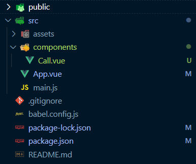
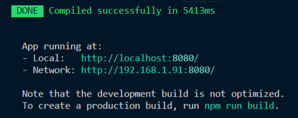
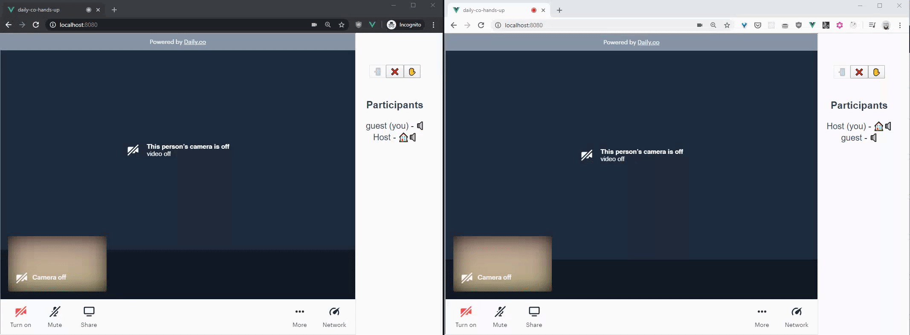

# Using Daily.co and Vue to create engaging video calls

## Background

As more people shift to remote work, it can be difficult to know what proper remote call etiquette is. Today we'll tackle the problem of helping participants know who should speak next. Consider the following scenario: a guest speaker has just given a very engaging presentation to your team. It's time for questions and everyone is clamoring to speak. Instead of speaking over each other, what if there was an easier way? 

It turns out there is. Just like at a live conference, audience members can raise their hands to ask questions. Using daily.js (daily.co's front-end library) and a bit of custom UI, let's solve this problem. 

---

## Dependencies and Pre-work 

>Assumptions: You have a basic knowledge of command line tools, javascript, Node.js, npm, and Vue. If any of these are unfamiliar please see _Further Reading_ at the end of this post. You will also need a daily.co [account](https://dashboard.daily.co/). 

We'll be using [Vue](https://vuejs.org) as a UI framework to simplify data management and templating. Make sure you have the CLI utilities installed since we'll be using them to scaffold out our project. 

The code for this tutorial is available on [github](https://github.com/philmillman/daily-co-hands-up) and you can try a live demo [here](https://daily-co-hands-up.now.sh/).

---

Install Vue CLI globally

```
npm install -g @vue/cli
```

Initialize your Vue project

```
vue create daily-co-hands-up
cd daily-co-hands-up
```

After going through various prompts and getting everything intialized, you should have a project structure which looks something like this: 



Lastly, go to your daily.co [dashboard](https://dashboard.daily.co/) and create a room for your project. I suggest creating a private room since it will prompt guests to enter a username, which will make it easier to identify them in the call. 

---

## Getting Started

Install the `daily-js`, daily.co's front-end library

```
npm i @daily-co/daily-js --save 
```

Start your development server

```
npm run serve
```

If all went well you will see something like this: 



You should be greeted with a generic Vue page. Let's get rid of it so we can get started. 

In the `/components` folder of your newly created project you will find a file called `HelloWorld.vue`. Delete its contents and rename it to `Call.vue`. 

Update any references to `HelloWorld` in `App.vue` to reference your new `Call` component. The `template` and `script` portions of `App.vue` should now look like this: 

```html
<template>
  <div id="app">
    <Call />
  </div>
</template>

<script>
import Call from './components/Call.vue'

export default {
  name: 'App',
  components: {
    Call
  }
}
</script>
```
----
## Making the Call 

Now let's focus on `Call.vue`. For simplicity's sake we will keep everything in this single component. In a production `Vue` app this would be separated into many components, but for our purposes let's keep things simple and leave everything in one spot. 

### The template

Our template is divided into three logical sections:
- The callframe where our daily.co iframe will get inserted and where the actual call takes place (`#callframe-target`)
- Some controls for joining, leaving, and raising your hand (`.controls-container`)
- A list of participants which will show if their hands are raised and some other information about them (`.participants-container`)

Here is what our template code looks like (add this to `Call.vue`): 

```html
<template>
  <div class="container">
    <!-- our render target -->
    <div id="callframe-target">
    </div>
    <div class="content">
      <!-- UI Call controls -->
      <div class="controls-container">
        <button @click="joinCall" 
        title="Join Call" 
        :disabled="buttonsDisabled.join">📲</button>
        <button @click="leaveCall" 
        title="Leave Call" 
        :disabled="buttonsDisabled.leave">❌</button>
        <button @click="toggleLocalHandState"
        :title="handTitle"
        :disabled="buttonsDisabled.hand">{{ handEmoji }}</button>
      </div>
      <!-- List of participants -->
      <div class="participants-container" v-show="hasJoined">
        <h3>Participants</h3>
        <ul >
          <li v-for="(participant, index) of participants" :key="index" :data-user_id="participant.user_id">
            <span v-if="participantsHandsRaised.includes(participant.user_id)">
              🙌 
            </span>
            {{ getParticipantName(participant) }} - {{ getParticipantBadgeString(participant)}}
          </li>
        </ul>
      </div>
    </div>
  </div>
</template>
```

As you can see:
- First we have an empty `div` which will be where our `callframe` goes. 
- Secondly, we have a `div` containing three buttons. Each of these has a click handler, denoted by the `@click` attribute as well as some other dynamic attributes (those which begin with "`:`"). 
- Lastly, we have a `div` containing an unordered list of `participants`. There are a few `Vue` specific things going on here, but at a high level you just need to understand that a dynamic list will be rendered. 


### The script

Next up is the secret sauce, provided by `Vue`. This may seem long at first, but we'll go over the important parts section by section. 

Add the following to `Call.vue` after the `template` section you previously added. 

```javascript
<script>
import DailyIframe from '@daily-co/daily-js';
const CALL_OPTIONS = {
  url: 'https://REPLACE.THIS.WITH/YOUR_MEETING_LINK',
  iframeStyle: {
    position: 'fixed',
    top: 0,
    left: 0,
    width: '80%',
    height: '80%'
  }
}

export default {
  name: 'Call',
  props: {},
  data: function () {
    return {
      buttonsDisabled: {
        join: false,
        leave: true,
        hand: true
      },
      hasJoined: false,
      participants: [],
      participantsHandsRaised: [],
      localParticipant: {},
      handRaised: false,
      callframe: {}
    }
  },
  computed: {
    handTitle: function () {
      return this.handRaised ? "Lower Your Hand" : "Raise Your Hand";
    },
    handEmoji: function () {
      return this.handRaised ? "🙌" : "✋";
    }
  },
  mounted: function () {
    const targetEl = document.getElementById('callframe-target')
    this.callframe = DailyIframe.createFrame(
      targetEl,
      CALL_OPTIONS
    ); 

    this.callframe
      .on('joined-meeting', (e) => {
        console.log("Event: ",e);
        this.hasJoined = true;
      })
      .on('participant-joined', (e) => {
        console.log("Event: ",e);
        if(e.participant.user_id !== this.localParticipant.user_id) {
            this.updateParticipants();
            setInterval(() => {
              this.shareHandState()
            }, 5000)
        }
      })
      .on('participant-updated', (e) => {
        console.log("Event: ",e);
        this.updateParticipants();
      })
      .on('participant-left', (e) => {
        console.log("Event: ",e);
        this.updateParticipants();
        this.updateRaisedHands({handState: false, ...e.participant});
      })
      .on('app-message', ({ data }) => {
        this.updateRaisedHands(data);
      });
  
  },
  methods: {
    async joinCall () {
      this.buttonsDisabled.join = true; 
      try {
        const participants = await this.callframe.join();
        this.participants = Object.keys(participants).map((key) => participants[key]);
        this.localParticipant = participants.local;
        this.buttonsDisabled.leave = false; 
        this.buttonsDisabled.hand = false; 
      } catch (e) {
        console.error('ERROR while joining meeting', e);
        return;
      }

    },
    getParticipantName: function (participant) {
      let name = "";
      if (participant.user_name) {
        name = participant.user_name;
      } else if (participant.owner) {
        name = "Host";
      } else {
        name = "guest"
      }

      if (participant.local) {
        name += " (you)";
      }
      return name;
    },
    getParticipantBadgeString: function (participant) {
      let badgeString = "";
      if (participant.owner) {
        badgeString += "🏠"
      }
      if (participant.audio) {
        badgeString += "🔈"
      }
      if (participant.video) {
        badgeString += "🎦"
      }

      return badgeString;
    },
    updateParticipants: async function () {
      const participants =  await this.callframe.participants();
      this.participants = Object.keys(participants).map((key) => participants[key]);
    },
    
    toggleLocalHandState: function () {
      this.handRaised = !this.handRaised;
      this.updateRaisedHands({handState:this.handRaised, ...this.localParticipant});
      this.shareHandState();

    },
    updateRaisedHands: function({ handState, user_id}) {
      if (!this.participantsHandsRaised.includes(user_id) && handState) {
        this.participantsHandsRaised.push(user_id);
      } else if (this.participantsHandsRaised.includes(user_id) && !handState) {
        this.participantsHandsRaised.splice(this.participantsHandsRaised.indexOf(user_id),1)
      }
    },
    shareHandState: function() {
      this.callframe.sendAppMessage(
        { handState : this.handRaised,
          ...this.localParticipant }
      )
    },
    leaveCall: function () {
      //reset initial state
      this.callframe.leave();
      this.participants = {};
      this.participantsHandsRaised = [];
      this.localParticipant = {};
      this.handRaised = false;
      this.buttonsDisabled.join = false; 
      this.buttonsDisabled.leave = true; 
      this.buttonsDisabled.hand = true; 
      this.hasJoined = false;
    },

  }

}
</script>
```
In the code above, we first import the `daily-js` library. For convenience's sake we'll declare a `CALL_OPTIONS` object so that we can reference it later. You can read more about the top-level configuration available in the [`daily-js` factory method docs](https://docs.daily.co/reference#the-dailyiframe-class). Also make sure to replace the `url` property with the daily.co url you created earlier. 

```javascript
import DailyIframe from '@daily-co/daily-js';
const CALL_OPTIONS = {
  url: 'https://REPLACE.THIS.WITH/YOUR_MEETING_LINK',
  iframeStyle: {
    position: 'fixed',
    top: 0,
    left: 0,
    width: '80%',
    height: '80%'
  }
}
```

Next up is some `Vue` component-specific stuff. 

The most important part is the `data` property which will set up the reactivity that we need in our template. All this means is that when one of these properties changes the template will update accordingly. You can see these properties referenced in the `template` section and used elsewhere in the `script` section. 

>Tip: any time you see `this.someProperty` it is referencing one of these data properties

```javascript
  data: function () {
    return {
      buttonsDisabled: {
        join: false,
        leave: true,
        hand: true
      },
      hasJoined: false,
      participants: [],
      participantsHandsRaised: [],
      localParticipant: {},
      handRaised: false,
      callframe: {}
    }
  }
  ```

Following that we have some `computed` properties which we use to change UI elements based on whether our hand is raised or not. 

```javascript
  computed: {
    handTitle: function () {
      return this.handRaised ? "Lower Your Hand" : "Raise Your Hand";
    },
    handEmoji: function () {
      return this.handRaised ? "🙌" : "✋";
    }
  },
```

Next we're starting to get into some `daily-js`-specific stuff. The `mounted` lifecycle method (which fires when our `#callframe-target` is in the DOM) will call `createFrame` ([docs](https://docs.daily.co/reference#%EF%B8%8F-createframe)). This will create and insert the daily.co iframe as a child of `#callframe-target`. Note that we're using the `CALL_OPTIONS` object we created above. 

```javascript
  mounted: function () {
    const targetEl = document.getElementById('callframe-target')
    this.callframe = DailyIframe.createFrame(
      targetEl,
      CALL_OPTIONS
    ); 
```

After this we're setting up our event listeners that will tell our app what to do when specific events are emitted. You can read about the full set of events in the `daily-js` [Events docs](https://docs.daily.co/reference#events). Aside from calling `updateParticipants` when someone joins, updates, or leaves, there are two very important things here to note. The first is that when someone joins we are calling `shareHandState`, which sends a message via the `daily-js` `sendAppMessage` method. This is so that new folks who join know who has their hand up. We are sending this after 5 seconds to ensure delivery of the message. Secondly, directly related to this, we are calling `updateRaisedHands` when a message is received to update each client's local view of whose hands are raised.  We'll look at these methods in more detail in the next section. 

```javascript
  this.callframe
    .on('joined-meeting', (e) => {
      console.log("Event: ",e);
      this.hasJoined = true;
    })
    .on('participant-joined', (e) => {
      console.log("Event: ",e);
      if(e.participant.user_id !== this.localParticipant.user_id) {
          this.updateParticipants();
          setTimeout(() => {
            this.shareHandState()
          }, 5000)
      }
    })
    .on('participant-updated', (e) => {
      console.log("Event: ",e);
      this.updateParticipants();
    })
    .on('participant-left', (e) => {
      console.log("Event: ",e);
      this.updateParticipants();
      this.updateRaisedHands({handState: false, ...e.participant});
    })
    .on('app-message', ({ data }) => {
      this.updateRaisedHands(data);
    });

  },
```

In addition to the `methods`, which we called above, there are also others used as click handlers from the template (ex. `joinCall`) or as convenience methods (ex. `getParticipantBadgeString`). 

Let's look at `joinCall` in more detail. Aside from managing some of the state of the buttons in the UI, the main thing going on here is a call to `this.callframe.join()` ([docs](https://docs.daily.co/reference#%EF%B8%8F-join)) which returns an object containing the meeting participants. For convenience (and to play nice with `Vue`), we store this as an array of objects and keep a separate copy of the `localParticipant`. 

```javascript
joinCall: async function () {
  this.buttonsDisabled.join = true; 
  try {
    const participants = await this.callframe.join();
    this.participants = Object.keys(participants).map((key) => participants[key]);
    this.localParticipant = participants.local;
    this.buttonsDisabled.leave = false; 
    this.buttonsDisabled.hand = false; 
  } catch (e) {
    console.error('ERROR while joining meeting', e);
    return;
  }

},
```

We mirror the above logic in `updateParticipants` which we mentioned earlier in the event listeners. `toggleLocalHandState` does exactly what it says as well as calling `updateRaisedHands` to update our local array of raised hands and broadcasting the change to other participants via `shareHandState`.

```javascript
  updateParticipants: async function () {
    const participants =  await this.callframe.participants();
    this.participants = Object.keys(participants).map((key) => participants[key]);
  },
  
  toggleLocalHandState: function () {
    this.handRaised = !this.handRaised;
    this.updateRaisedHands({handState:this.handRaised, ...this.localParticipant});
    this.shareHandState();

  },
  updateRaisedHands: function({ handState, user_id}) {
    if (!this.participantsHandsRaised.includes(user_id) && handState) {
      this.participantsHandsRaised.push(user_id);
    } else if (this.participantsHandsRaised.includes(user_id) && !handState) {
      this.participantsHandsRaised.splice(this.participantsHandsRaised.indexOf(user_id),1)
    }
  },
  shareHandState: function() {
    this.callframe.sendAppMessage(
      { handState : this.handRaised,
        ...this.localParticipant }
    )
  }
```

Finally, `leaveCall` calls the `daily-js` `leave()` method and resets the `Vue` data to its initial state. 

```javascript
  leaveCall: function () {
    //reset initial state
    this.callframe.leave();
    this.participants = {};
    this.participantsHandsRaised = [];
    this.localParticipant = {};
    this.handRaised = false;
    this.buttonsDisabled.join = false; 
    this.buttonsDisabled.leave = true; 
    this.buttonsDisabled.hand = true; 
    this.hasJoined = false;
  },
```

### Ending in style 

The last piece of a `Vue` component is the `style` section. Add the following to `Call.vue` after the `script` section and adjust to your tastes.

```css
<style scoped>

.content {
  padding-left: 80%;
}
h3 {
  margin: 40px 0 0;
}
ul {
  list-style-type: none;
  padding: 0;
}

button:disabled {
  opacity: 25%;
}
</style>
```

----

## Summary 

If everything has gone according to plan you should now have a fully functional (albeit slightly spartan) video conferencing app where users can raise their hands to get each other's attention. We accomplished this by leveraging `daily-js` events, `app-message` in particular. And we did it all with no server (of our own that is, thanks daily.co team 😉). 



## Next steps

Here are a few suggestions on ways to make this app even better: 

- Let owners lower raised hands (once their questions have been answered, of course)
- Show the raised hands in a separate sorted queue 
- Dynamically create meetings via the daily.co [REST API](https://docs.daily.co/reference#create-room)


## Thanks

Thanks for reading! Feel free to reach out on [twitter](https://twitter.com/philmillman) to show off your enhancements or if there's anything I can help with. 

## Further Reading

- [Vue](https://vuejs.org)
- [Node.js](https://nodejs.dev/)
- [npm](https://www.npmjs.com/)
- [Daily.co Docs](https://docs.daily.co/docs)